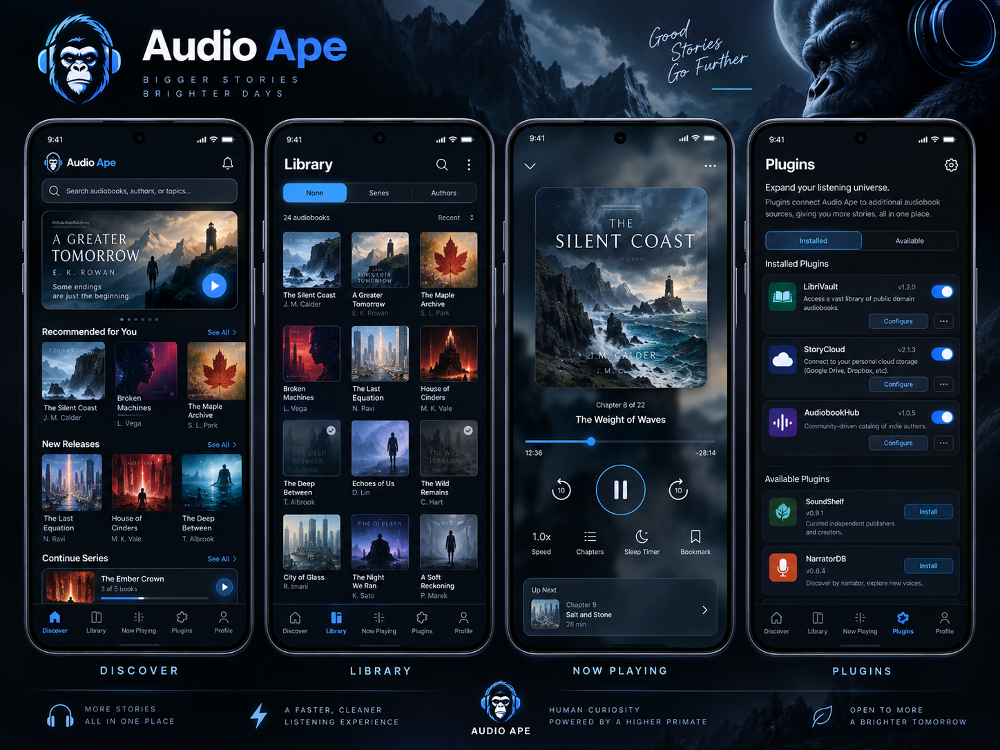
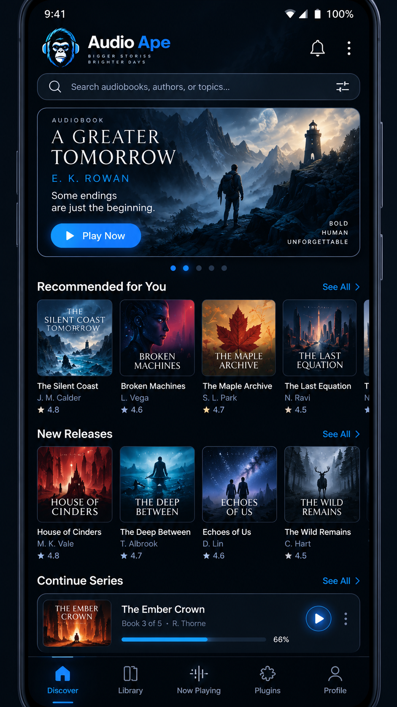
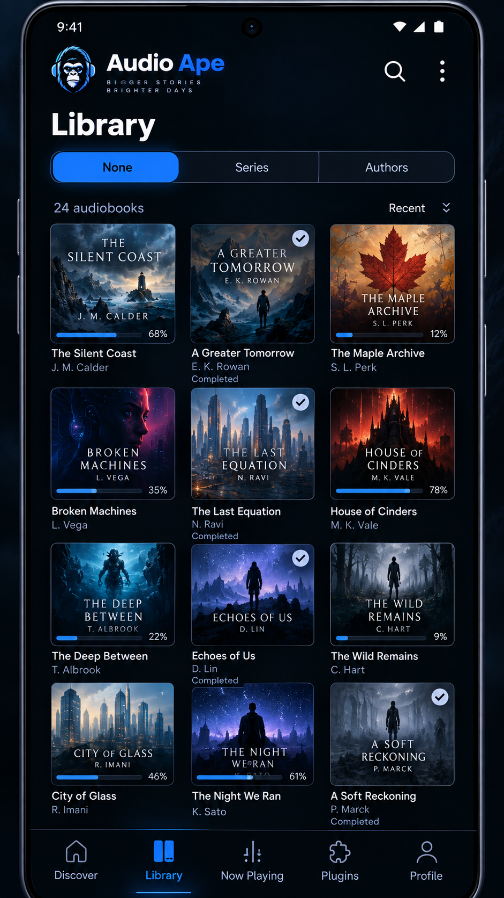
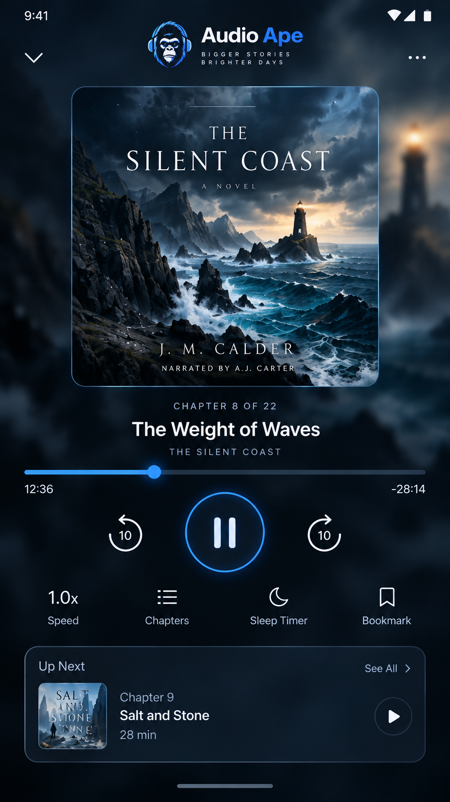
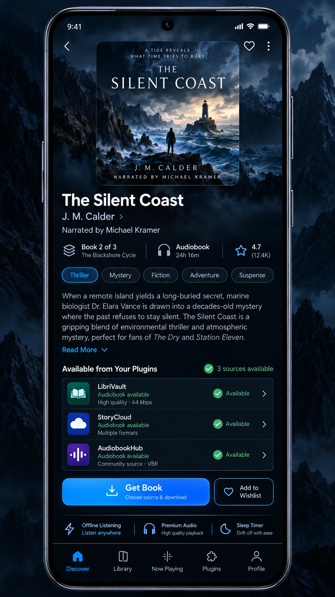
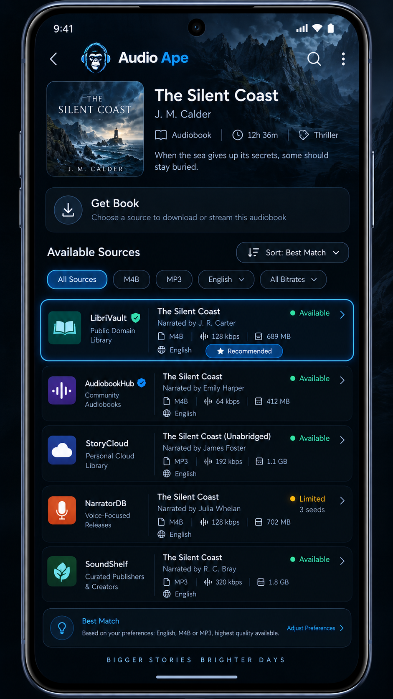
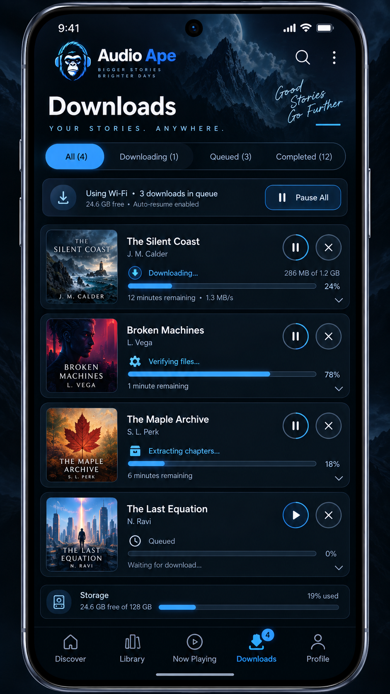
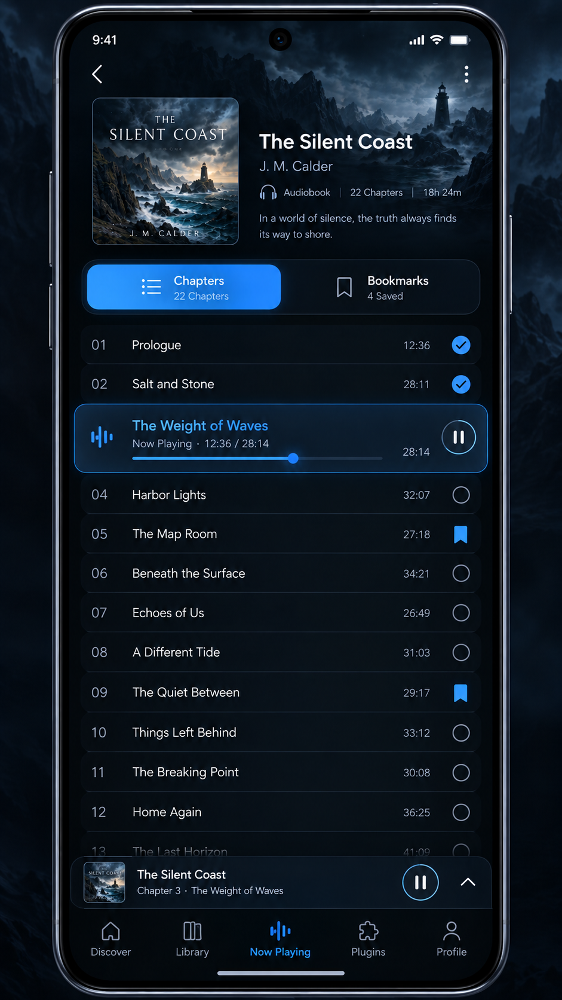
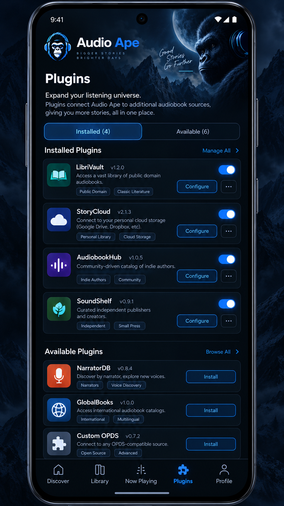
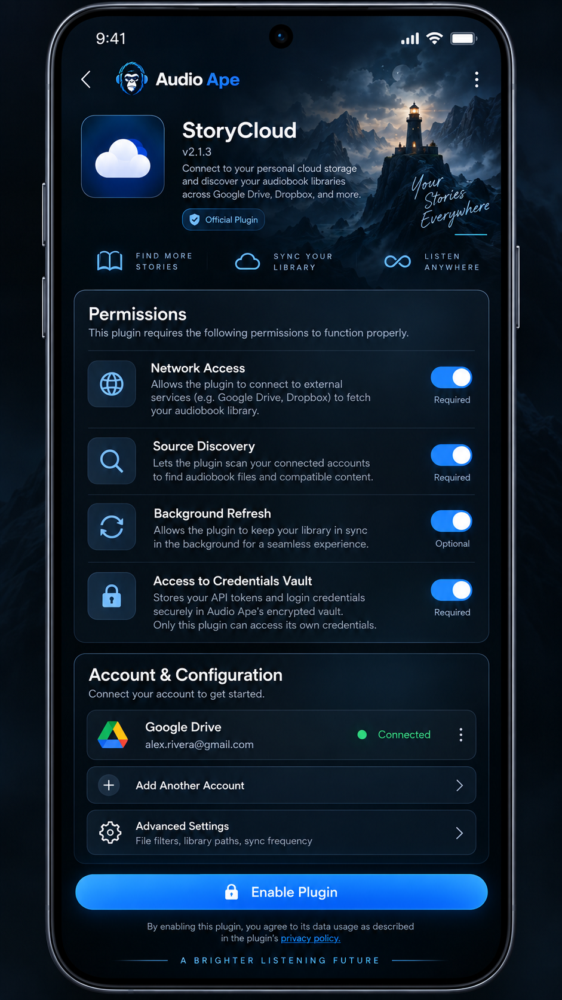

# AUDIO APE
## Complete product and engineering specification — Codex implementation authority

**Version:** 2.0 design handoff • **Research cut-off:** 2026-09-19 • **Status:** planned, not implemented • **Owner:** Nick

> **READ FIRST:** This is a build specification, not an assertion that the Android project, third-party integrations or app-store approval exist. Read [`START_HERE.md`](START_HERE.md) and [`AGENTS.md`](AGENTS.md). The screenshots are AI-generated visual references with fictional content and occasional functional discrepancies. Actual behavior below supersedes screenshot text. The ten original PNGs are provided in [`assets/mockups`](assets/mockups).



## 0. Product definition, audience and success

Audio Ape is an **Android-first, genuinely standalone, offline-first local audiobook player** with fast, polished, visually distinctive playback and an open **declarative, capability-based, backend-only plugin ecosystem**. A user searches for a confirmed audiobook edition, opens details, taps Get Book, chooses an installed plugin, examines its detailed source releases, and chooses Download. The app, rather than the plugin, queues transfer, verifies the payload, safely unpacks if required, derives book structure, imports files and artwork into the user's persistent audiobook folder and adds the title to the library. Without plugins, it remains a fully useful local player.

**Product goals [GOAL-01–08]:** top-tier listening controls comparable in breadth to Smart Audiobook Player (not a pixel copy); immediate perceived response; consistent headphone-ape branding; clean dark-blue visual identity; no proprietary backend/account for launch; persistent **user-accessible** audiobook media; comprehensive import reliability; future iOS compatibility at the plugin **protocol** level rather than a promise of portable native binaries.

**Non-goals at launch:** user account; cloud sync; local backup/export of listening state; listening streaks/stats; light theme; SD-specific flows; full Android Auto browse UX; broad accessibility audit (though essential semantics and tap targets must be implemented now); iOS app; proprietary catalog service; independent native APK plugins; unconstrained executable/script extensions. Only future-ready seams—not half-built unused systems—for these.

**Do not promise:** all commercial audiobooks, authentic chart rankings, exactly known publication order or chapter times, all codecs on all devices, no gaps in badly encoded media, perfect progress preservation after abrupt loss of power, automatic third-party service authorization, one-click system APK installation, or App Store approval. Missing coverage must be explicit and graceful. See [R01–R29](docs/RESEARCH_AND_RISKS.md).

### 0.1 Prior decisions superseded and mockup contradictions

- **Storage:** prior plan suggested private app-managed storage. **LATEST DECISION:** selectable *user-accessible* tree as default, files survive uninstall, app-private progress/history/bookmarks/collections deleted on uninstall and excluded from backup/device transfer (subject to tested platform semantics). No metadata sidecars with personal listening history.
- **Sources:** mockup combines multiple plugin releases under one list; **actual flow** requires select plugin FIRST, then show only that plugin's releases.
- **Accounts:** mockups say Profile and show a signed-in Google Drive account; **V1 has no Audio Ape account or profile**. Replace Profile with Settings, and never show a connected third-party account unless user actually connected a future plugin.
- **Mockup names/ratings:** 'The Silent Coast', 'LibriVault', 'StoryCloud', ratings and release availability are fictional layout fixtures; never treat as verified books, functional providers, live ratings or endorsements.
- **Plugin type:** data-only, portable bounded interpreter, not unrestricted native code. Third-party GitHub installation lives behind Advanced settings + explicit permission approval; curated store auto-updates by default; permissions expanding require renewed consent.
- **Discover:** only independently **confirmed audiobook editions**, one primary provider initially; search executes on submit, not keystroke; offline cached catalog may be visible but new internet search/download isn't functional offline.
- **Audio navigation:** chapters take precedence. Embedded data first; exact-edition online chapter lookup only with user confirmation; otherwise multi-file boundaries if they are confidently chapter-like, finally +/-30-minute buttons with quick mode toggle. Never synthesize chapter titles from arbitrary 30-minute windows.
- **Deletion:** deleting an individual audiobook invokes one permanent-delete confirmation for Audio Ape-managed owned file(s); retain minimal local history flag for Discover while installed. Uninstall of app preserves audio files but removes local history and preferences; do not add an uninstall-interception or two-confirmation app removal screen.

## 1. Product functional requirements (normative)

Legend: **P0** release-blocking; **P1** planned before 1.0 if demonstrated feasible and tested; **FUTURE** excluded from 1.0. Each identifier maps to implementation/test coverage in `docs/EXECUTION_PLAN.md`.

### 1.1 Player and media integration

- **[PLY-001 P0]** Playback through AndroidX Media3 ExoPlayer inside `MediaLibraryService`, with `MediaLibrarySession`; UI talks via `MediaController`, never directly owns the player. Foreground media notification, lock-screen/system controls and headset/car media buttons share one authoritative player state. Provide MediaBrowser tree architecture for Android Auto later. [R01,R02,R03]
- **[PLY-002 P0]** Accept validated container+codec combinations for `.m4b`, `.m4a`, `.mp3`, `.flac`, `.ogg` (Vorbis and Opus only where tested) and `.wav`. Probe actual decoders; give explicit unsupported/DRM errors without deleting media. V1 compatibility table records device/OS/codec. [R04]
- **[PLY-003 P0]** Ordered multiple audio parts appear as one book with a canonical cumulative millisecond timeline and seamless next-part handoff; measure gaps using reference PCM fixtures and real devices. Do not conflate logical continuous book with rewriting audio into one file.
- **[PLY-004 P0]** Pause/play, configurable back/forward default 10 s, next/previous chapter, full-book and chapter-position displays, book-wide precision seeking, visible track progress. At end of chapter automatically continue; no auto-advance past end-of-book.
- **[PLY-005 P0]** Embed chapter titles and times from trusted tags/containers. Online chapter acquisition matches **exact narration/edition/duration**, shows provenance and asks permission ALWAYS, even if high-confidence. Quick switch between chapter jumps and +/-30-min jumps, preserving player position. If chapter data absent or untrustworthy, file boundaries qualify only when semantically supported; otherwise +/-30 min.
- **[PLY-006 P0]** Scrubber shows a floating secondary preview with book HH:MM:SS and chapter+chapter offset; actual player position does not jump every pixel: preview on drag and seek on release; cancel returns to old position. Clamp handles and values to timeline boundaries; viewport-clamp bubble; no stutter on 30+hour books. Show full duration and remaining time clearly.
- **[PLY-007 P0]** Remember speed separately per book, preserve pitch across supported speeds. Smart resume rewind enabled by default, duration-based and configurable/off; store true last played position, apply rewind only on user-initiated resume. Do not rewind across chapter start unless explicitly configured.
- **[PLY-008 P0]** Sleep timer: 15/30/45/60m, custom interval, end of chapter; lock-screen/notification extension if device/system session supports it; expiration pauses playback. Decide timer countdown when paused by implemented explicit policy and test it (proposed: count active playback time; visible in settings).
- **[PLY-009 P0]** Bookmark exact book timeline location, optional name/note, list and jump actions. Manual editing/rename/delete. Book-specific settings and bookmarks migrate to replacement only after safe edition matching and mapping checks.
- **[PLY-010 P0]** Audio route removed => pause immediately, suppress switch to loudspeaker; reconnection NEVER auto-plays. Interruption from call/navigation/audio-focus loss => pause and wait for explicit play; test focus gain/duck edge cases and modern Media3 audio focus. Cold launch/reboot restores item and near-last-saved position **paused**. Implement explicit play buttons in media notification / connected controllers. [R02]
- **[PLY-011 P1]** Optional loudness normalization, silence shortening, voice boost, simple 3-band EQ, global defaults and per-book overrides with reset. Test device audio-effects availability, actual output, clipping, CPU and battery; avoid assuming Media3 includes an automatic full-featured loudness normalization algorithm. Offload incompatibility must be surfaced when relevant. Functions with no safe tested implementation become explicitly documented deferred subfeatures rather than placebo toggles. [R17]
- **[PLY-012 P0]** Completion: true end stops, marks book finished, dims cover with 'Completed' text, prompts about next series book and keep/delete local download. At ~90–95% allow completion ONLY if known credits/outro/actual last-content marker or explicit user action establishes book content ended; no blanket 90% auto-completion. After 30 days offer to remove completed book's local files; never auto-delete.
- **[PLY-013 P0]** Persist checkpoint on pause, seek, chapter/part transition, and every ~10s during playback (batch transactions); write on normal shutdown when possible. After force-stop/unclean kill accept bounded checkpoint loss; never claim perfect millisecond precision.

### 1.2 Library, import and deletion

- **[LIB-001 P0]** Default is an **Audio Ape folder chosen through Android's system document-tree picker** and optionally newly created within a permitted user-accessible directory. On Android 11+ the picker cannot grant device storage root or Downloads root; do not fake a guaranteed one-tap path. Display simple one-time prompt and suggested folder name, offer alternative location. Store persistent URI grant and verify read/write capabilities. Avoid `MANAGE_EXTERNAL_STORAGE`. [R05,R06]
- **[LIB-002 P0]** On first run ask before importing any existing files. Distinguish choosing a managed library folder from granting temporary import-source permission. Initial existing imports use COPY-first into managed tree; do not move/delete external originals without express user selection. Store persisted references only as needed. If library folder access is revoked or unavailable, show a reconnect flow without deleting DB records or playing nonexistent media.
- **[LIB-003 P0]** Startup renders last-known Room state immediately; detect changes with cheap URI/metadata comparisons asynchronously. Trigger heavier metadata/hash/cover lookup in bounded work; if full scan would be disruptive, prompt unobtrusively. Manual rescan and full rebuild in Settings; do not repeatedly ask each launch. No network/blocking disk traversal on splash.
- **[LIB-004 P0]** Import .zip plus researched additional archive formats if vetted decoder available; encrypted/password archives require prompt or clear unsupported error. Stage in private temporary storage, verify length/hash when available, validate entries, prevent zip slip/symlink tricks/zip bombs; parse and stage source files, infer group/title and cover; commit via reversible journal then delete verified archive after successful durable import. Never claim SAF destination rename is universally atomic. [R14]
- **[LIB-005 P0]** Confidence metadata pipeline: manual override > trusted embedded/local tags and cover > confidently matched approved provider > safe normalized filename/folder fallback. User edits take permanent precedence. Verify title/author/series/narrator/edition independently; store provenance and confidence; ambiguous matches prompt before changes; no unrelated-file mass renames.
- **[LIB-006 P0]** Library is a 3-column adaptive book-art grid at reference phone width, with name and author under cover; group selector None / Series / Authors persists choice. Series first-class ordered by source-documented publication order; allow recommended reading order where credible and manual reorder. Collections allow membership in more than one custom collection.
- **[LIB-007 P0]** Default ordering uses most recent activity (max(lastListenedAt, importedAt)); tie-break stable ID. Single search box indexes local title, author, narrator, series. Library tap opens player and resumes at saved point on user action. Removed books are not in library search; if locally deleted, minimal tombstone remains only for Discover 'Previously listened' / 'Recently deleted' indications.
- **[LIB-008 P0]** Detect byte-exact duplicate via file hash and likely same-edition duplicate by strong typed IDs + narrator/duration/part evidence. Ask keep both / replace / cancel, never auto-merge. For higher quality replacement, migrate progress/bookmarks/speed only after duration/chapter equivalence verified; prompt when uncertain or abridged.
- **[LIB-009 P0]** Individual Delete shows a single clear irreversible confirmation and deletes ONLY files in the selected book's Audio Ape-managed namespace, their managed art and app records. If shared files between book records exist, avoid deleting media referenced elsewhere. No trash or undo. Keep a tiny local history record (book identifier/completed/deleted, no media) only while installed; erase all app-private data on uninstall.
- **[LIB-010 P0]** Media survive uninstall. Progress, notes, bookmarks, completion, collections, credentials, plugin configuration and history **do not** survive uninstall and must not be placed in external storage or restored by Android Auto Backup, device transfer or provider-specific restore; test Android data-extraction rules on target versions. Reinstall prompts to reconnect existing folder, reindexes covers/chapters, starts listening positions fresh. External independent backups cannot be controlled. [R16]

### 1.3 Discover and acquisition UX

- **[DIS-001 P0]** Zero local books -> Discover startup; otherwise return to lightweight last-listening home/player. Hybrid Discover home: prominent submit-only search; featured section when backed by valid catalog data; source-attributed recommendation rails by local author/genre/series, credible new releases/popular data if provider can support them, expandable browse grid. No fabricated global chart or title counts.
- **[DIS-002 P0]** Search button/IME action initiates remote search; typing alone never sends requests. Result is **confirmed audiobook edition**, not generic print/ebook work. Keep exact edition identity, narrator, audio publication date, language, abridgment status and duration where known; unknown values shown as 'Not listed'. Provider/attribution visible where required. If one initial candidate provider cannot support audio-only catalog, fail gate or use a confirmed-audio-only provider; do not silently switch to general books. [R18,R19,R20]
- **[DIS-003 P0]** Book details show cover, title, author, narrator if known, genre, short description, series index, edition data, duration if known, locally owned/completed/deleted badges. Plugins begin source discovery in background on details open, with cache limits/rate protection; if still resolving when Get Book is tapped, show per-plugin loading, empty or error states.
- **[DIS-004 P0]** Get Book -> choose an installed, eligible plugin **first** (visible capability/state, including 'searching'). Then navigate to **only that plugin's** source results. Detailed release rows show every verified available field (release title, narrator, language, edition, format/codec, bitrate, file size, duration, file count, health/cache state as provider permits, source provenance). Never fabricate fields.
- **[DIS-005 P0]** User's global download preferences (quality, formats, max size, language, edition/abridgment) with optional per-plugin overrides determine sorting and highlighted match; no forced source. Match narrator/edition before automatic retry source switching, and never silently select abridged or different-language audio. Any provider-specific auth stays in logical plugin-scoped credential vault.
- **[DIS-006 P0]** Avoid recommending completed books; still allow explicit search, series/author browsing. Deleted titles in Discover show 'Previously in your library' without adding them to local Library or restoring old progress. Offline show cached browse pages only if license permits; online download/search clearly unavailable.

### 1.4 Downloads and notifications

- **[DLD-001 P0]** Durable Room-backed queue with `queued`, `resolving`, `awaiting_provider`, `transferring`, `verifying`, `extracting`, `identifying`, `importing`, `completed`, `paused`, `waiting_wifi`, `waiting_storage`, `retry_scheduled`, `failed`, `cancelled`; transition validator is single source of truth. 2 concurrent transfers default, optionally 3 as budget allows; import/extraction serialized or capacity-bounded independently.
- **[DLD-002 P0]** Wi-Fi-only initially; explicit cellular override, storage free-space estimate (archive + expanded payload + margin), low-space prompt/no cleanup without consent; persistent pause/resume/cancel/reboot recovery and idempotent stage restart. Distinguish OS scheduler handles from persisted app job IDs. [R07]
- **[DLD-003 P0]** Simple default download card (art, percent if calculable, stage, time remaining only when credible), expandable technical view for speed/bytes/provider/file list/verification/extraction/status/errors. Android **persistent active-download notifications** with progress and actionable pause/resume/cancel as permitted by Android version, plus success/error outcome. Notification action PendingIntents must be explicit/immutable or correctly mutable, validated, and idempotent.
- **[DLD-004 P0]** Resume with HTTP Range only after confirming response status, Content-Range, entity identity/ETag; if unsupported, restart safely with clear UI. Retry transient network/429/5xx with bounded exponential backoff + Retry-After; refresh expiring provider URLs rather than caching them forever. On permanent source failure, try another **same-edition matching** source in same selected plugin; only cross-plugin choice if user explicitly chooses a different plugin. Bounded retry budget and readable final error.
- **[DLD-005 P0]** Android 14+ user-initiated transfer jobs where eligible and started from allowed foreground condition; earlier Android versions need tested, policy-compliant foreground-service/backward-compatible strategy. Use WorkManager for short retryable index/metadata tasks, **not** as a universal substitute for unrestricted multi-hour transfers. Download notification/FGS declarations tested on current target SDK. [R07]

### 1.5 Plugins, security and privacy

- **[PLG-001 P0]** Versioned, cross-platform **data-only declarative** package with bounded capabilities: `catalog`, `metadata`, `source_search`, `acquisition_resolver`, `authorization`. Plugins do not ship UI or arbitrary executable code. Host defines all HTTP primitives, extractors, data mapping and download operations. Plugin types compose: Audiobook Bay-like catalog/source adapter and separate provider resolver for Real-Debrid/TorBox are independent contracts; actual names/features must be approved against legal/policy/terms gate.
- **[PLG-002 P0]** Built-in directory uses signed static registry JSON hosted via GitHub Pages/Releases (no server under Audio Ape control), searchable cards, detailed permissions, one-tap install after explicit initial consent, auto-update by default with opt-out and rollback. Offline installed plugins still exist; network-dependent functionality states clearly unavailable. [R12]
- **[PLG-003 P0]** GitHub repository/release URL or file installation under Settings > Advanced > Allow third-party plugins, with two distinct approval surfaces: (a) enable advanced mode; (b) individual package trust/permitted domains/capabilities and credential use. Basic schema/hash/size/compatibility validation always enforced. GitHub repo webpage is not automatically a package artifact: resolve explicitly defined release manifest/asset or fail gracefully. Never execute README instructions.
- **[PLG-004 P0]** Every plugin is given its own namespaced credentials and settings schema and only receives its own secrets via approved auth actions; physically the **Android host's encrypted app-private vault** holds bytes for data-only plugins. Do not claim separate OS-level sandbox/UID without separate app; namespacing and runtime checks are logical isolation. Credential UI generated by Audio Ape. Repermission on scope/domain expansion; disable repeated-crash/error plugins and notify.
- **[PLG-005 P0]** No broad filesystem, arbitrary URLs, insecure redirects, unbounded response bodies, unrestricted script execution or arbitrary code install. Curated plugin registry and third-party signing trust differ; show actual verification state. Validate archive/package signatures, SHA-256, schema, source allowlist and version compatibility; rollback last known good on failed update. A warning cannot make dangerous capabilities safe. [R11,R13]
- **[PLG-006 P0 feasibility gate]** Audiobook Bay source + Real-Debrid/TorBox resolver requires source rights/terms evaluation, authorized test title, official/provider API confirmation, redaction, observed end-to-end integration and store-policy review **before** shipping or advertising. No assumption that a debrid subscription grants permission to download copyrighted books. Build proof of concept with a legal public-domain/permissioned sample and a fake provider as needed; keep real integration explicitly blocked unless gate passes. [R09,R10,R11,R22]
- **[PRV-001 P0]** No Audio Ape accounts, server, tracking SDK, analytics or unsolicited telemetry. Local rolling minimally identifying diagnostic logs; 'Report a problem' previews/redacts log bundle and invokes user-directed share sheet only after consent. Avoid raw book titles, folder paths, tokens, signed URLs, emails, IP addresses by default. User can clear logs and plugin credentials. On uninstall all private logs/secrets removed, with automatic OS backup/restoration excluded and verified.

### 1.6 Future-facing seams — do not implement premature complexity

**[FUT-001]** iOS SwiftUI/AVAudioEngine-or-AVPlayer feasibility/entitlement review, same platform-neutral plugin manifest where permitted; no claim the Android parser/Media3 service is portable. **[FUT-002]** Full Android Auto UI and Desktop Head Unit acceptance; MediaLibraryService browse skeleton NOW. **[FUT-003]** Accounts/cloud sync, later optional local user-controlled backup, migration policies. **[FUT-004]** Light/custom themes, complete TalkBack/dynamic type/localization study, SD-specific support, listening stats, advanced recommender. **[FUT-005]** Advanced chapter editor; permissioned user-driven media conversion; carefully licensed additional plugins.

## 2. Visual target and mockup index

A family of ten generated images establishes the visual direction. **Do not render PNG mockups as flattened application screens.** Rebuild every interactive element as native Compose content. Extract/reapprove individual brand/cover assets as needed and do not assume generated text is consistently spelled.

| Image | File | Implemented destination |
|---|---|---|
| Overall style | `00_visual_overview.png` | palette, ape motif, relative density only |
| Discover | `01_discover.png` | home carousel, source-backed rails, search |
| Library | `02_library.png` | grid, grouping, completion badges |
| Player | `03_player.png` | full-bleed cover focus, transport and controls |
| Details | `04_book_details.png` | exact audio-edition metadata, Get Book |
| Sources | `05_source_results.png` | **selected plugin only** (correct screenshot's merged list) |
| Downloads | `06_downloads.png` | queue, progress, expandable rows |
| Chapters | `07_chapters.png` | titles, chapter/30-minute toggle, bookmarks |
| Plugins | `08_plugins.png` | directory, install/enable/update |
| Plugin consent | `09_plugin_permissions.png` | granular scopes, logical vault, configuration |

### 2.1 Discover

**Native layout:** app brand strip, single prominent text input with search IME action, featured card 16:9 with poster/copy only when real confirmed audiobook/permissions, lazy horizontal recommendation rails and Continue the Series, expandable all-catalog grid, subtle persistent mini-player only when a book is loaded. No fictional ratings on production tiles. Card images have real cover aspect ratio (often ~1:1 or publisher supplied); do not warp to placeholder. Show empty-catalog, loading/skeleton, offline-cached, no-provider and rate-limited states. Search waits for submit.

### 2.2 Library

Grouping segmented selector None / Series / Authors; book cover width responsive (3 columns at reference width, 2 on narrow, 4+ on tablets). Finished art dimmed plus visible Completed label/check, not color-only. Progress strip overlays only when progress exists. Title/author always accessible beyond truncation. Grouped series displays count, series name and ordered detail list. Long press opens actions without changing single-tap resume behavior. Search covers title/author/narrator/series at once. A removed book never appears here.

### 2.3 Now Playing

Player should be immersive: top close/collapse and overflow, centered crisp book cover on softly blurred/dim backdrop, current chapter number/title, full-book secondary metadata, clear time labels, precision progress and big play/pause flanked by +/-10s. Row for speed, chapters, sleep and bookmark. 'Up next' means next **chapter** or next series book if no next chapter, never a fabricated second book. For smaller screens, keep transport visible and scroll ancillary information rather than shrinking tap targets. No distracting constantly moving animated background during screen-off or scrolling.

### 2.4 Book Details

Cover/description/author/narrator/series and edition context. Use data-backed duration and provider attribution, not made-up star scores. Actual button opens **plugin choice**, not a merged aggregated source list. Background source-search status is non-blocking and per plugin. If book already local, primary action becomes Play/Resume with secondary find-other-edition action. Title/cover background can tint a low-resolution blurred scrim, subject to GPU/memory benchmark.

### 2.5 Source Results

The screenshot is a *style reference* only: its 'All Sources' merged tabs conflict with approved plugin-first UX. Correct production hierarchy: `Book details > Get Book > Choose plugin > Plugin X sources`. Source rows expose available technical fields and one highlighted best match per stored preferences, no hidden/guessed bitrate. Show source identity and last check, unavailable/cached/unknown only with truthful provider semantics, confirm user selection for a differently narrated or abridged release. No global single search across other plugins once selected.

### 2.6 Downloads

Persistent queue with All/Downloading/Queued/Completed filters; top transfer/Wi-Fi/storage banner; rows show verified real stage, animated progress at modest update cadence; expandable technical diagnostics; actionable notification mirroring pause/resume/cancel. Percentage represents known byte transfer; overall multistage percent must be defined and never jump backwards without labeled stage. No two contradictory progress representations.

### 2.7 Chapters and bookmarks

Chapter list, current highlight, completed/progress affordance; switch to bookmark list; `Chapter jump | 30-minute jump` quick mode selector within player/chapter sheet. Mockup inconsistent chapter numbers are test content, not implementation data. Timestamp must show consistent book-wide and chapter-local units. Mini-player remains accessible without obscuring final rows.

### 2.8 Plugin directory and permission screen


Directory: Installed/Available with verified/community badges and actual last verification date, version, enabled state, per-plugin update setting, repository link. Replace decorative 'official' badge with verifiable trust status only. Permissions: source host/domain allowlist, source discovery, catalog/metadata, network budget, *own* credentials. Required permissions are explained, not represented as freely toggleable if functionality cannot operate without them. V1 does **not** show an Audio Ape-wide Profile/account or connected Google Drive unless the user actively connected that plugin in a later release.

## 3. Navigation and page states

**Proposal for first Compose build:** modern restrained five-destination bottom bar `Discover | Library | Now Playing | Downloads | Plugins`; Settings accessible from header overflow/gear, **NOT Profile**. The images variably show Profile in place of Downloads; resolve with explicit Downloads destination to support persistent queue. Keep bar 56–72dp effective visual height plus navigation insets, hide/compact on immersive full-screen player while preserving back behavior. Original prior hamburger/left drawer was earlier inspiration, but user approved the new mockup direction; do **not** implement redundant drawer plus bottom bar without a usability gate. Actual final navigation must be approved after interactive prototype on 360dp, 393dp and 600dp widths; this is the sole unresolved presentation-level choice.

Routes: `discover/home`, `discover/search?q`, `discover/edition/{editionId}`, `discover/edition/{id}/plugins`, `discover/edition/{id}/plugins/{pluginId}/sources`, `library`, `library/group/{groupId}`, `player`, `player/chapters`, `downloads`, `downloads/{jobId}`, `plugins`, `plugins/{pluginId}`, `plugins/{pluginId}/permissions`, `settings`, `settings/storage`, `settings/audio`, `settings/advanced`, `settings/report`.

**State coverage required for every screen:** initial/empty, loading, content, invalid data, offline, permission denied, retryable error, permanent error, interrupted navigation and long text. All navigation must preserve current playback and make back deterministic. No fabricated success transitions or green checks before host/provider confirms actual state.

## 4. Technical foundation and boundaries

### 4.1 Android stack

Kotlin, Gradle Kotlin DSL and version catalog, Android Studio stable with matching Android Gradle Plugin and supported JDK (resolve/pin versions from current official compatibility matrix during Phase 0), AndroidX Jetpack Compose and Navigation Compose, Material 3 *primitives* heavily customized by Audio Ape tokens, Hilt or tested lightweight DI, Coroutines/Flow, Room with FTS and migrations, DataStore for nonsecret prefs, Media3 ExoPlayer + MediaLibraryService, OkHttp and kotlinx.serialization, image loader with tested content-URI support (e.g. Coil when current stable Android/Compose compatibility verified), WorkManager for short jobs and version-aware user-initiated transfer job/foreground approach for long downloads, Android Keystore-backed secret encryption. Do not pin an unverified dependency version in this spec. Initial **minSdk 29 proposal**; reassess against target phone and build dependencies, current Play targetSdk before release.

Repository shape, introducing modules only when boundaries are genuine:

```text
app/                    Activity, navigation, manifest, release variants
core/model/             pure Kotlin Work, Edition, LibraryItem, MediaPart, Chapter, Source
core/database/          Room entities, DAO, schema exports, migration tests
core/storage/           SAF URI/documents adapter, staging, import journal
core/network/           allowlisted HTTP, caching, retries, no unbounded fetch
core/designsystem/      tokens, reusable UI components, branded icons
feature/player/         Compose player, controller ViewModel and chapter/scrub UI
feature/library/        import, cover grid, FTS search, collections, groupings
feature/discover/       audiobook-specific catalog, edition detail, recommendations
feature/downloads/      persistent queue, notifications, transfer, verification
feature/plugins/        directory, permissions, typed config, install/update
plugin/protocol/         JSON schema, capability negotiation, fixture contracts
plugin/host/             LIMITED interpreter, logical vault, allowlist, execution limits
plugin/fixtures/         fake providers and legal public-domain sample adapter
benchmark/              Baseline Profiles, launch/scroll/player Macrobenchmarks
docs/                   decisions, licenses, threat model, traceability
.github/workflows/      CI + controlled release
```

**Dependency rule:** UI -> use cases -> domain repository interfaces -> platform implementations. Plugin engine returns immutable structured data and never accesses Room/SAF/player directly. Player cannot import plugin implementation code. Discover does not know whether library media was imported manually or acquired. Background jobs can exist independent of a foreground UI.

### 4.2 Models, invariants and storage semantics

Canonical IDs are internal UUIDs plus typed external aliases; do not assume one book/work ID equals one audio edition. `Work` (written content), `AudioEdition` (narrator/language/publisher/abridgment), `LibraryBook` (locally owned logical item), `MediaPart` (ordered playable URI), `Chapter` (book-wide span), `SourceRelease` (plugin-specific acquisition), `DownloadJob`, `BookHistoryTombstone`, `UserMetadataOverride`, `Collection` + membership, `PluginInstall`, `PluginGrant`, `PluginSettings`, `PlaybackCheckpoint`, `Bookmark`. Put non-user public metadata provenance separately from user edits. Explicit unique keys and foreign-key cascade policy in architecture doc.

At most ONE active `LibraryBook` pointer per playback controller at a time; a book may have >=1 media part. `0 <= bookmark.position <= book.duration` when duration known. Download cannot be `completed` until media is playable from committed destination and DB references are durable. Plugin cannot receive another plugin's secret, even via logging or redirects. User-approved folder URI is not a filesystem path and may become unavailable without warning. `completed` book status is private and lost on app uninstall by user request.

### 4.3 Algorithms that must be deterministic

**Book timeline:** part starts are prefix sums `start[0]=0; start[i+1]=start[i]+duration[i]` with checked 64-bit arithmetic. For seek `t`, clamp to `[0,total]`, binary search rightmost part start <=t, compute `local=t-start[i]`; explicitly handle unknown durations and end boundary. Seek bookmark and chapter operate in book timeline independent of Media3 item index.

**Metadata confidence:** an explicit override beats all automated candidates. A candidate includes field, value, source URL/URI, confidence and edition binding. Do not collapse weak title+author match into an exact narrator match; unknown remains unknown. Resolve conflicts via a reversible per-field preview; never alter other folders while 'cleaning'.

**Duplicate candidate:** hash exact file; strong edition ID plus matching narrator, runtime and file/chapter evidence -> high confidence; same title only -> review. On replacement, record mapping and checkpoint migration transaction; ask for manual new position if duration mismatch makes mapping ambiguous.

**Acquisition retry:** do not retry a 401 credential error in a tight loop. Network retry has backoff/cap, URL refresh, idempotency when provider supports it; alternative release switch requires equivalence proof and does not increase data/storage budget without notice. If full matching fails, pause for user input.

**Atomic-ish SAF import:** staged validated source -> reserve destination names -> write temp docs and flush streams -> verify lengths/checksums -> create durable journal with URI ID mappings -> commit Room transaction references only after verification -> cleanup temp and only then delete archive. SAF move/rename may not be atomic; reconcile journal on restart and preserve recoverable source until complete. Never recursively delete user-selected root.

## 5. Quality metrics (proposed, measurable, not promises)

- Reference mid-range phone selected in Phase 0: median cold first frame <=1.5 s and interactive >=local player/library <=2.0 s on warm local DB; record device, OS, sample size, build type. Prioritize nonblocking startup over rigid artificial cutoff.
- Library 500+ synthetic covers: 95th percentile frames within tested device's refresh budget on measured scroll; stable keys, thumbnails, no synchronous large art decode.
- Player seek preview reaction perceived immediate; no >100 ms repeated main-thread stall in automated benchmark under 30-hour audiobook; voice controls route within session test fixture.
- Screen-off playback 2h soak; no avoidable fatal crash, no accidental speaker audio on disconnect, monitor battery/CPU/RAM and DSP effects.
- Downloads: pause/resume/relaunch/power loss/partial-archive/missing permission/Wi-Fi transition/insufficient space test matrix; concurrent transfer max 2/3 and bounded background CPU.
- Every main screen tested at common small/medium widths and dynamic system bars; screenshot golden comparisons after density/font normalization. Never claim PNG-to-Compose literal pixel perfection on all devices.
- Baseline minimum 48dp effective hit areas, clear semantic labels for transport controls, readable text contrast; full screen-reader/theming study remains future but V1 should not ship unlabelled essential actions. [R15]

## 6. Security, legal and distribution gate

- Encrypt plugin tokens in app-private storage backed by Android Keystore with supported current crypto implementation; version vault and handle invalidated keys by re-authentication. Disable cloud/device transfer backup of vault and all app-private user data. Network URL allowlist and redirect revalidation, TLS, DNS/IP SSRF controls for local/private address targets, bounded HTTP bodies, no credential forwarding across hosts.
- Signed curated registry and independent publisher keys; pinned verified registry signing public key shipped with app. Hashes are integrity checks, not identity alone. Advanced GitHub packages require explicit trust display; no guarantee an unverified package is safe. Static declarative definitions must not be powerful enough to replicate arbitrary code through conditionals/loops/regex or unrestricted HTTP templating.
- Verify code licenses, font/brand rights, book-cover permissions and provenance. Generated imagery can be used as approved visual reference, but confirm publication rights, trademark conflicts and isolate icon from generated poster before a commercial public release. Do not publish fictional books/providers as live content.
- Google Play restricts downloading executable code and apps encouraging unauthorized copyrighted downloads; Apple has additional guidelines for downloadable plugins. GitHub distribution is not a copyright exemption. The source plugin can be researched privately with a permissioned test item; publishing it is a separate go/no-go gate. [R09,R10,R11]
- Make app signing plan before distributing first APK if in-place migration to Play desired; same package/signing lineage is not automatic with Play App Signing. Never commit signing key or secrets. No automatic app self-update in Play variant.

## 7. Milestones and traceability

Authoritative fully expanded step-by-step tickets are in [`docs/EXECUTION_PLAN.md`](docs/EXECUTION_PLAN.md). The ordering is deliberate:

| Gate | Deliverable | Must demonstrate |
|---|---|---|
| G0 | foundation/toolchain/assets & feasibility | real phone build, source art inventory, honest provider/catalog constraints |
| G1 | player+storage vertical slice | user-selected persistent media + screen-off playback + process recovery |
| G2 | plugin acquisition spike | legal public-domain/authorized sample from search through plugin to verified import; provider-specific gate recorded |
| G3 | visual system + full screen shells | screenshot/interaction comparison for 10 refs, corrected flow and Settings |
| G4 | complete player, chapters/audio | codec, timeline, focus, sleep, bookmarks, precision seek |
| G5 | robust import/library | safe archives, metadata, duplicates, series, collections, manual overrides |
| G6 | audiobook-only Discover and plugins | confirmed provider, submit-search, secure installation, credentials, per-plugin results |
| G7 | download resilience and notifications | persistent 2–3 queue, retry/switch, low storage, process and Wi-Fi recovery |
| G8 | hardening and beta | policy review, migration, tests, benchmarks, legal/brand approvals |
| G9 | GitHub release | verified signed APK, hashes, no blocking data loss/security bugs, docs |

**Critical path:** build *two* early parallel vertical slices (reliable offline local playback and demonstrably limited data-plugin acquisition). Do not invest in a complete fancy Discover before verifying a real audiobook-specific catalog and a legal sample acquisition. A validated false assumption about one API can invalidate months of UI work.

## 8. Read these supporting documents before implementation

- [`docs/DESIGN_SYSTEM.md`](docs/DESIGN_SYSTEM.md): tokens, components, motion, per-screen states and screenshot discrepancy/acceptance checklist.
- [`docs/ARCHITECTURE_AND_CONTRACTS.md`](docs/ARCHITECTURE_AND_CONTRACTS.md): exact interfaces/entities/state machine, URL and manifest constraints, media lifecycle and uninstall preservation.
- [`docs/EXECUTION_PLAN.md`](docs/EXECUTION_PLAN.md): tickets, sequences, test methods, checkpoint formats.
- [`docs/RESEARCH_AND_RISKS.md`](docs/RESEARCH_AND_RISKS.md): first-party reference URLs checked 2026-09-19 and explicitly unvalidated claims.
- [`contracts/plugin-manifest.schema.json`](contracts/plugin-manifest.schema.json) and examples for the initial interpreter design.

**End of primary specification. No source code, APK, app-store approval or provider end-to-end integration is claimed in this document.**
